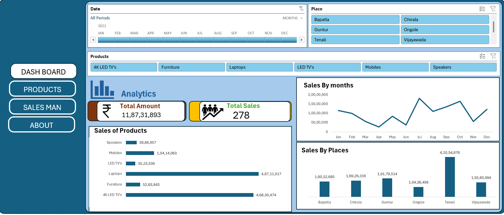
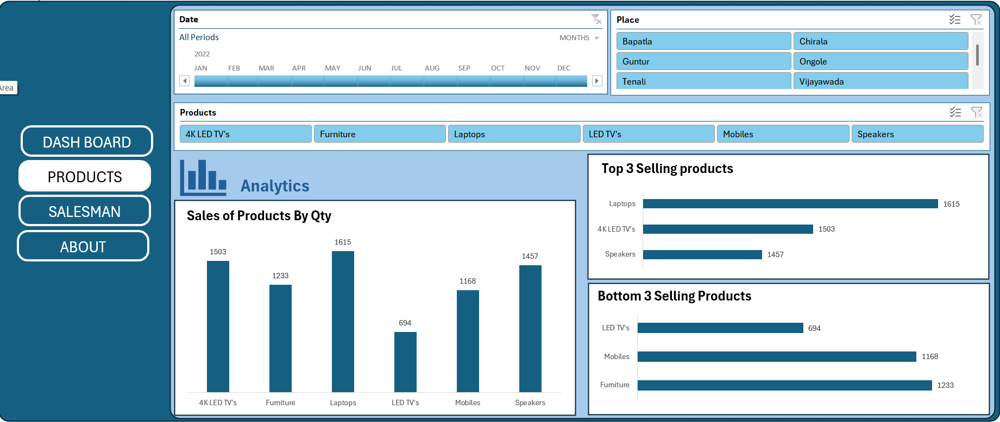
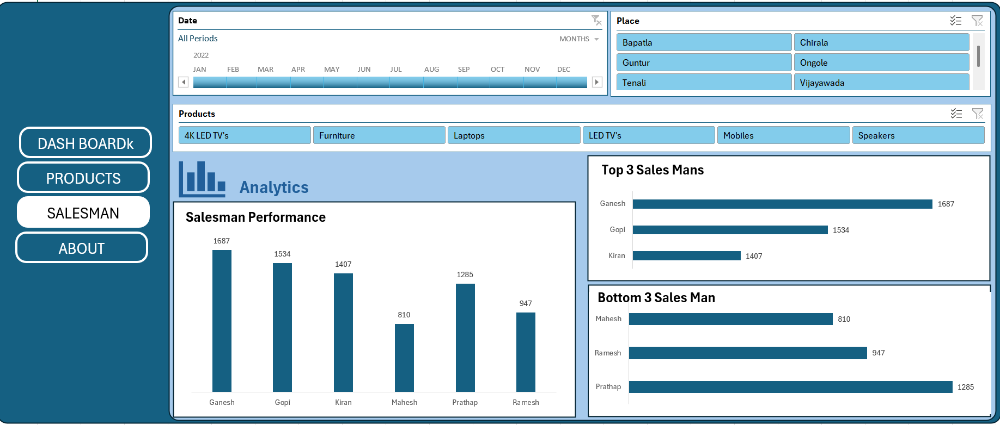
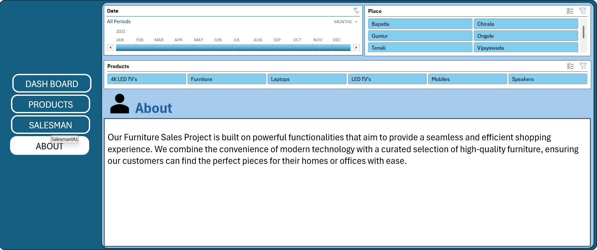

# 🪑 Furniture Sales Report (Excel Dashboard)

This project analyzes sales performance data of a furniture business using *Excel*. The dashboard is interactive and includes filters by date, product, and location.

---

## 📊 Dashboard Preview

### Dashboard Page

### Products Page

### Salesman Page

### About Page

---

## 📂 Files Included
- Furniture-sales.xlsx – Excel dashboard with slicers, charts, and formatting
- PNG images – Screenshots of each dashboard page

---

## 🔍 Insights Covered
- Monthly sales trend
- City-wise performance
- Product category comparison
- Salesman-level breakdown

---

## 🛠 Tools Used
- Microsoft Excel
- Pivot Tables
- Charts & Slicers
- Dashboard UI Design

---

## 🙋 Author
*Jagadeesh Vallepu*

Connect with me on [LinkedIn](https://www.linkedin.com/in/jagadeeshvallepu/)
